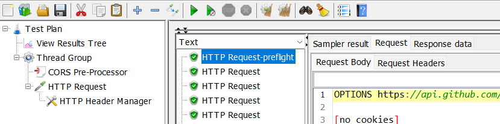
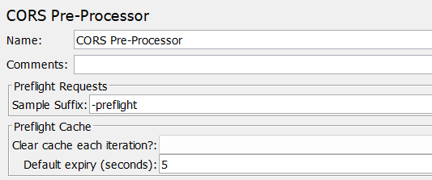

# jmeter-cors-plugin 

Overview
--------

[Apache JMeter](https://jmeter.apache.org/) plugin for making [CORS-preflight requests](https://fetch.spec.whatwg.org/#cors-preflight-request)
before HTTP requests to resources on other origins. 

Similar to how a browser preflights cross-origin requests, e.g. REST API requests from
[single-page applications](https://en.wikipedia.org/wiki/Single-page_application),
this plugin creates a preflight request if necessary, without the need to explicitly
add a Sampler for it to the JMeter Test Plan. 

It also simulates a [CORS-preflight cache](https://fetch.spec.whatwg.org/#cors-preflight-cache) to avoid
unnecessary preflight requests, just as a browser would.

#### Example

Usage
-----

### Retry Post-Processor

Simply add a *CORS Pre-Processor* to the [Scope](https://jmeter.apache.org/usermanual/test_plan.html#scoping_rules)
of any samplers that should make preflight requests. 

#### Preflight Requests

- *Sample Suffix*: String to append to the preflight request's sample label (default: "-preflight").

#### Preflight Cache 
 
- *Clear cache each iteration?*: When set to "True" or "False" the preflight cache can be explicitly cleared or kept 
  between Thread iterations. When left blank, it is only cleared when Thread Group property
  "Same user on each iteration" is *not* set.   
- *Default expiry (seconds)*: Cache expiry duration to apply when no "Access-Control-Max-Age" header is returned.
  This allows overriding the 5 seconds the [specification](https://fetch.spec.whatwg.org/#http-access-control-max-age) defines.

Installation
------------

### Via Manual Download

1. Copy the [jmeter-cors-plugin jar file](https://github.com/tilln/jmeter-cors-plugin/releases/download/1.0-SNAPSHOT/jmeter-cors-plugin-1.0-SNAPSHOT.jar) into JMeter's lib/ext directory.
2. Restart JMeter.

Limitations
-----------

- Minimum JMeter version 5.2.1
- Timers, Post-Processors, and Assertions are **not** executed for the preflight request,
  but only any Pre-Processors that precede the CORS Pre-Processor. 
- CORS Pre-Processors are not "aware" of one another, so if a sampler's Scope contains more than one,
  multiple preflight requests will be made.
